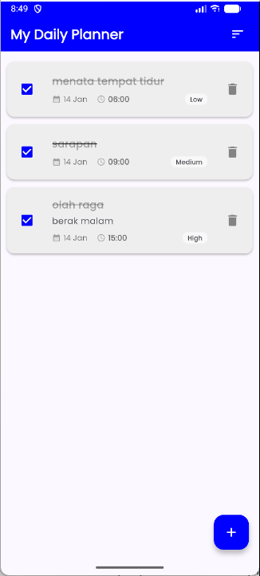

# SimpleTask - Daily Planner & Organizer

  
  <h1>SimpleTask</h1>
  

    <strong>Productivity • Tools • Scheduler</strong>
  

---

## 📱 Tentang Aplikasi

**SimpleTask** adalah aplikasi manajemen tugas harian yang dirancang untuk meningkatkan produktivitas. Dibangun menggunakan **Flutter** dan **SQLite**, aplikasi ini menawarkan pengalaman manajemen tugas yang cepat, ringan, dan bekerja sepenuhnya secara offline.

Aplikasi ini dibuat sebagai pemenuhan **UAS Mata Kuliah Pemrograman Bergerak**.

### Fitur Unggulan:
* ✅ **Smart CRUD:** Tambah, Edit, dan Hapus tugas dengan validasi input.
* ⏰ **Time Management:** Dilengkapi *Time Picker* (24H) dan Date Picker.
* 🔥 **Priority System:** Kategorisasi tugas (High 🔴, Medium 🟠, Low 🔵).
* 📊 **Smart Sorting:** Filter tugas berdasarkan *Deadline Terdekat* atau *Prioritas*.
* 🎨 **Modern UI:** Antarmuka bersih dengan tema *Electric Blue*.
* 💾 **Local Database:** Data tersimpan permanen (Persistent Storage).

---

## 📸 Screenshots

|  |  | 

---

## 🎥 Video Demo

Lihat demonstrasi singkat penggunaan aplikasi SimpleTask di sini:

*(Klik gambar di atas untuk memutar video)*

---

## 📥 Download Aplikasi

File aplikasi dapat diunduh melalui menu **Releases** di repository ini:

* **[📂 Buka Halaman Download (Releases)](../../releases)**
  *(Tersedia file .aab untuk submisi Play Store)*

---

## 📄 Informasi Teknis

* **Nama Paket:** `com.example.uas_app` (Label: SimpleTask)
* **Versi:** 1.0.0
* **Target SDK:** Android 14
* **Framework:** Flutter SDK
* **Database:** sqflite

---

## 🔒 Kebijakan Privasi

**SimpleTask** menghargai privasi Anda:
1.  **Offline First:** Aplikasi berjalan sepenuhnya tanpa internet.
2.  **No Data Collection:** Kami tidak mengumpulkan data pribadi apapun.
3.  **Local Storage:** Semua tugas tersimpan aman di memori internal perangkat Anda.

---

## 📞 Kontak Developer

* **Email:** davindra_2205101092@mhs.unipma.ac.id
* **Repository:** https://github.com/dapz03/SimpleTask-UAS

---
Copyright © 2026 SimpleTask Project.